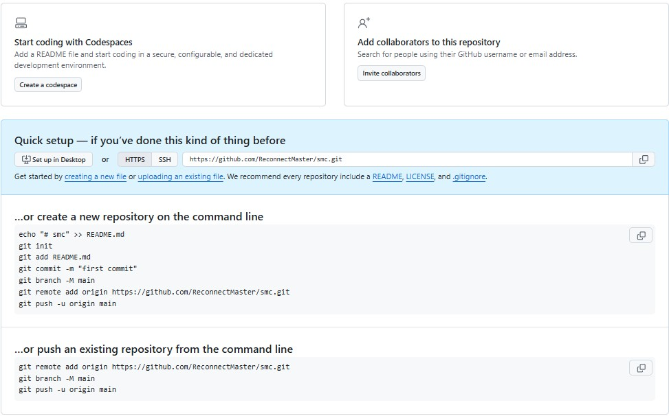

# Github Basic Structure

### README.md
Explains what the project is about. It’s the first thing visitors see.

### .gitignore
Lists files/folders Git should not track (like node_modules/, .env, or build outputs)

### LICENSE
Defines how others can legally use your code. Without it, your repo defaults to “all rights reserved.”

### CONTRIBUTING.md
Optional, but useful if you expect collaborators. It explains how to submit changes.

### CODE_OF_CONDUCT.md
Sets community standards for behavior.

### CHANGELOG.md
Tracks version history and updates

> [!Notice]

The most useful starting point is usually README.md (to explain your project) and .gitignore (to keep clutter out). After that, you can add a LICENSE if you want others to use your code.